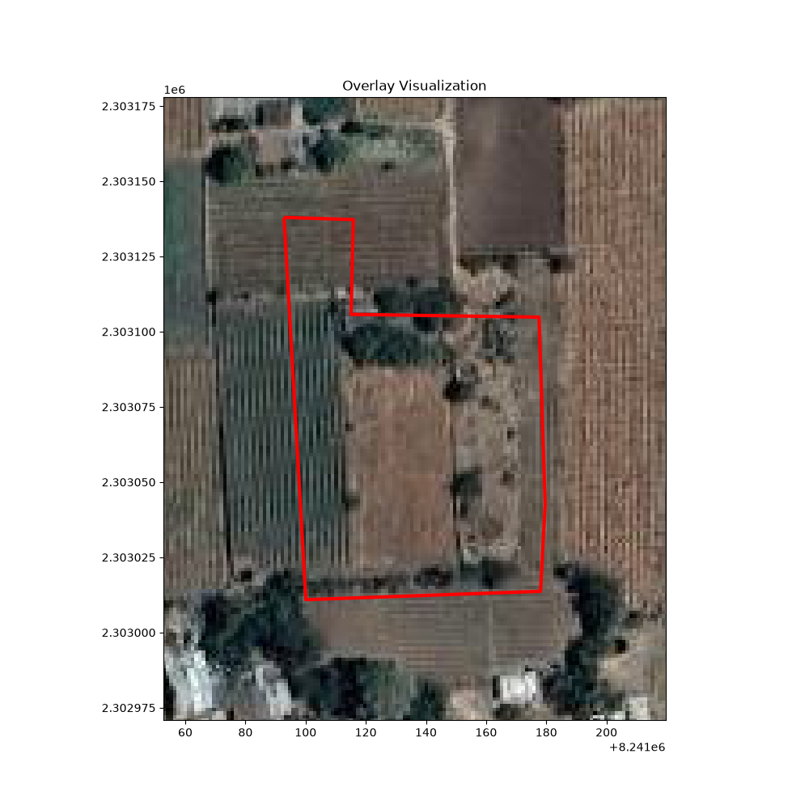

# BhuMe AI Assignment – Cadastral Boundary Correction Pipeline

## Project Overview

This project implements a geospatial correction pipeline for cadastral land parcel boundaries using satellite imagery and GeoJSON polygon data.

The system analyzes land plot geometries, applies conservative spatial corrections, assigns confidence scores, and generates corrected prediction outputs in GeoJSON format.

The solution focuses on:

* GIS workflow understanding
* Raster and vector data processing
* Polygon correction logic
* Confidence calibration
* Automated batch processing

---

# Assignment Context

This project is based on the BhuMe AI Take-Home Assignment focused on cadastral boundary correction in Maharashtra land records.

The assignment provides:

* cadastral plot polygons (`input.geojson`)
* satellite imagery (`imagery.tif`)
* optional boundary hints (`boundaries.tif`)
* sample corrected truths (`example_truths.geojson`)

The objective is to estimate more accurate ground-truth plot boundaries using geospatial processing techniques, assign confidence scores, and flag uncertain corrections.

---

# Technologies Used

* Python
* GeoPandas
* Rasterio
* Shapely
* Matplotlib

---

# Dataset Components

| File                        | Purpose                            |
| --------------------------- | ---------------------------------- |
| `input.geojson`             | Original cadastral plot boundaries |
| `imagery.tif`               | Satellite imagery                  |
| `example_truths.geojson`    | Sample corrected plots             |
| `final_predictions.geojson` | Generated corrected output         |

---

# Project Workflow

The pipeline follows these stages:

1. Load cadastral GeoJSON polygons
2. Load satellite imagery
3. Align CRS systems
4. Visualize polygon overlays
5. Apply conservative correction logic
6. Estimate confidence scores
7. Process all plots automatically
8. Generate final GeoJSON predictions

---

# Correction Logic

The implemented system uses a conservative correction strategy:

* Most polygons remain unchanged
* Small safe shifts are applied selectively
* Large uncertain corrections are avoided
* Confidence decreases as correction magnitude increases

This approach prioritizes:

* restraint,
* stability,
* and realistic GIS correction behavior.

---

# Confidence Logic

Confidence scores are assigned based on correction magnitude:

| Shift Distance | Confidence |
| -------------- | ---------- |
| No shift       | 0.98       |
| Small shift    | 0.85       |
| Moderate shift | 0.70       |
| Large shift    | 0.50       |

---

# Final Results

## Pipeline Summary

* Total Plots Processed: **2457**
* Corrected Plots: **492**
* Unchanged Plots: **1965**
* Average Confidence: **0.954**

---

# Overlay Visualization



This visualization demonstrates:

* cadastral polygon overlay,
* satellite imagery alignment,
* and spatial correction workflow.

---

# Final Output

The final generated prediction file:

```text
outputs/final_predictions.geojson
```

contains:

* corrected geometries,
* confidence scores,
* and status labels.

---

# Project Structure

```text
bhume-starter-kit/
│
├── bhume/
├── outputs/
│   └── final_predictions.geojson
│
├── screenshots/
│   └── overlay_visualization.png
│
├── src/
│   └── main.py
│
├── README.md
├── pyproject.toml
├── quickstart.py
└── uv.lock
```

---

# How to Run

## Install dependencies

```bash
uv sync
```

## Run pipeline

```bash
uv run python src/main.py
```

---

# Future Improvements

Possible future enhancements include:

* Edge detection using imagery
* Image segmentation models
* IoU optimization
* Machine learning based correction
* Automated drift estimation
* Advanced confidence calibration

---

# Conclusion

This project demonstrates a complete geospatial processing workflow for cadastral boundary correction using Python GIS tools.

The implemented pipeline successfully:

* processes all plots,
* applies conservative corrections,
* assigns confidence scores,
* and generates scalable GeoJSON predictions.

The solution emphasizes engineering clarity, GIS fundamentals, and reliable spatial processing workflows.
